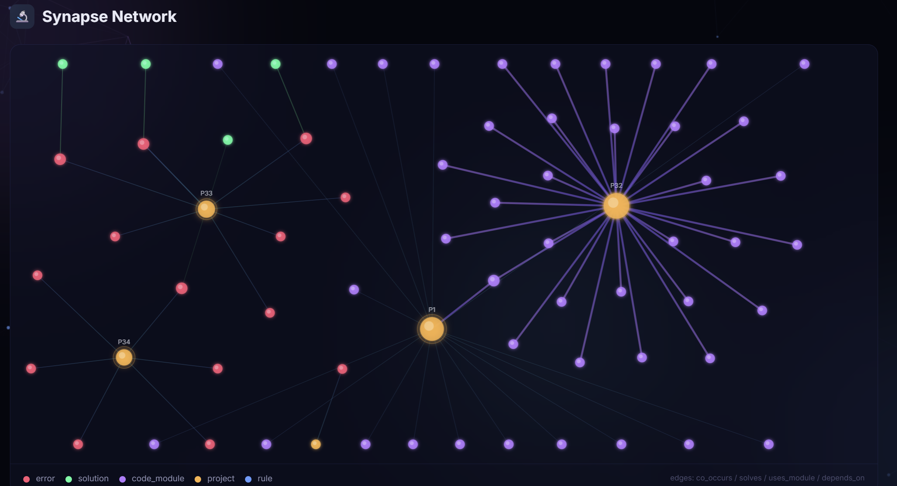

# Brain

**Adaptive Error Memory & Code Intelligence System for Claude Code**



Brain is an MCP server that gives Claude Code a persistent memory. It remembers every error you've encountered, every solution that worked (or didn't), and every code module across all your projects. Over time, it learns — strengthening connections between related concepts through a Hebbian synapse network, surfacing patterns, and proactively suggesting solutions before you even ask.

## Why Brain?

Without Brain, Claude Code starts fresh every session. With Brain:

- **Errors are solved faster** — Brain matches new errors against its database and suggests proven solutions with confidence scores
- **Cross-project learning** — Brain remembers fixes from your other projects and suggests them automatically
- **Code is never rewritten** — Before writing new code, Brain checks if similar modules already exist across your projects
- **Patterns emerge automatically** — The research engine analyzes your codebase to find trends, gaps, and synergies
- **Knowledge compounds** — Every fix, every module, every session makes Brain smarter
- **Errors are caught automatically** — Hooks detect errors in real-time and report them to Brain without manual intervention
- **Proactive prevention** — Brain warns you BEFORE an error occurs when it detects code matching known antipatterns
- **Semantic search** — Local embeddings enable vector-based similarity search alongside TF-IDF matching
- **Universal access** — REST API and MCP over HTTP make Brain available to any tool, IDE, or CI/CD pipeline

## Features

### Core Intelligence
- **Error Memory** — Track errors, match against known solutions, learn from successes and failures
- **Code Intelligence** — Register and discover reusable code modules across projects
- **Hebbian Synapse Network** — Weighted graph connecting errors, solutions, code modules, and concepts. Connections strengthen with use (like biological synapses)
- **Spreading Activation** — Explore related knowledge by activating nodes in the synapse network
- **Research Engine** — Automated analysis producing actionable insights: trends, gaps, synergies, template candidates
- **Learning Engine** — Pattern extraction, rule generation, confidence decay, antipattern detection with adaptive thresholds

### Smart Matching (v1.3+)
- **Context Enrichment** — Errors are enriched with task context, working directory, and command information
- **Error Chain Tracking** — Detects when errors cascade from fix attempts ("this error arose while fixing error #12")
- **Module Similarity** — Pairwise similarity detection finds duplicate code across projects
- **Cyclomatic Complexity** — Complexity metrics flow into reusability scores
- **Source Hash Detection** — Skips re-analysis for unchanged modules, triggers re-analysis on changes
- **Dependency Synapses** — Internal imports create `depends_on` synapses, enriching the network

### Advanced Intelligence (v1.4+)
- **Cross-Project Transfer Learning** — Matches errors against resolved errors from ALL projects, not just the current one
- **Proactive Prevention** — Post-write hook checks new code against known antipatterns before errors occur
- **Adaptive Thresholds** — Learning thresholds auto-calibrate based on data volume (10 errors vs. 500 errors need different sensitivity)
- **User Feedback Loop** — Rate insights and rules as useful/not useful to improve future analysis

### Visualization (v1.5+)
- **Live Dashboard** — SSE-powered real-time dashboard with streaming stats
- **Health Score** — Single-number indicator of how well Brain is performing
- **Error Timeline** — Daily error counts over time, per project
- **Error Explain** — Full "medical record" of any error: solutions, chains, related errors, rules, insights

### Git Integration (v1.6+)
- **Commit Linking** — Link errors to git commits (introduced_by, fixed_by)
- **Diff-Aware Context** — Captures current git diff and branch when errors occur
- **Commit History** — Track which commits introduced errors and which fixed them

### Universal Access (v1.7+)
- **REST API** — Full HTTP API on port 7777 with RESTful routes + generic RPC endpoint
- **MCP over HTTP/SSE** — Standard MCP protocol over HTTP for Cursor, Windsurf, Cline, Continue, and other tools
- **Batch RPC** — Send multiple API calls in a single request
- **API Key Auth** — Optional authentication via `X-API-Key` header

### Semantic Search (v1.8+)
- **Local Embeddings** — all-MiniLM-L6-v2 (23MB) runs locally via ONNX, no cloud required
- **Hybrid Search** — Triple-signal matching: TF-IDF + Vector Similarity + Synapse Boost
- **Background Sweep** — Embeddings are computed automatically for all entries
- **Graceful Fallback** — Works without embeddings; vector search enhances but isn't required

## Quick Start

### Installation

```bash
npm install -g @timmeck/brain
```

Or from source:

```bash
git clone https://github.com/timmeck/brain.git
cd brain
npm install
npm run build
```

### Setup with Claude Code

Add Brain's MCP server and auto-detect hook to your Claude Code configuration (`~/.claude/settings.json`):

```json
{
  "mcpServers": {
    "brain": {
      "command": "brain",
      "args": ["mcp-server"]
    }
  },
  "hooks": {
    "PostToolUse": [
      {
        "matcher": {
          "tool_name": "Bash"
        },
        "command": "node C:\\Users\\<YOU>\\AppData\\Roaming\\npm\\node_modules\\@timmeck\\brain\\dist\\hooks\\post-tool-use.js"
      }
    ]
  }
}
```

> **Note:** Replace `<YOU>` with your Windows username. On macOS/Linux, the path is the global npm prefix (run `npm prefix -g` to find it).

### Setup with Cursor / Windsurf / Cline / Continue

Brain v1.7+ supports MCP over HTTP with SSE transport. Add this to your tool's MCP config:

```json
{
  "brain": {
    "url": "http://localhost:7778/sse"
  }
}
```

Make sure the Brain daemon is running (`brain start`).

### Start the Daemon

```bash
brain start
brain status
brain doctor    # verify everything is configured correctly
```

The daemon runs background tasks: learning cycles, research analysis, synapse maintenance, confidence decay, and embedding computation.

### Import Your Projects

```bash
brain import ./my-project
brain projects              # see all imported projects
```

Brain scans for source files (TypeScript, JavaScript, Python, Rust, Go, Shell, HTML, CSS, JSON, YAML, TOML, Markdown, SQL, and more) and registers code modules with reusability scores.

## Architecture

```
+------------------+     +------------------+     +------------------+
|   Claude Code    |     |  Cursor/Windsurf |     |  Browser/CI/CD   |
|   (MCP stdio)    |     |  (MCP HTTP/SSE)  |     |  (REST API)      |
+--------+---------+     +--------+---------+     +--------+---------+
         |                        |                        |
         v                        v                        v
+--------+---------+     +--------+---------+     +--------+---------+
|   MCP Server     |     |   MCP HTTP/SSE   |     |    REST API      |
|   (stdio)        |     |   (port 7778)    |     |   (port 7777)    |
+--------+---------+     +--------+---------+     +--------+---------+
         |                        |                        |
         +----------+-------------+------------------------+
                    |
                    v
         +----------+-----------+
         |      BrainCore       |
         |  (Daemon / Services) |
         +----------+-----------+
                    |
    +-------+-------+--------+--------+
    |       |       |        |        |
    v       v       v        v        v
+---+--+ +--+---+ +-+-----+ +-+----+ +-+--------+
|Error | |Code  | |Synapse| |Git   | |Embedding |
|Memory| |Brain | |Network| |Intel | |Engine    |
+---+--+ +--+---+ +-+-----+ +-+----+ +-+--------+
    |       |       |        |        |
    v       v       v        v        v
+---+--+ +--+---+ +-+-----+ +-+----+ +-+--------+
|Learn | |Module| |Hebbian| |Commit| |Vector    |
|Engine| |Score | |Learn  | |Track | |Search    |
+------+ +------+ +-------+ +------+ +----------+
                    |
                    v
         +----------+-----------+
         |     SQLite (DB)      |
         |  better-sqlite3      |
         +----------------------+
```

### Core Components

| Component | Purpose |
|-----------|---------|
| **Error Memory** | Stores errors with fingerprints, matches new errors against known ones using hybrid search |
| **Solution Tracker** | Records solutions with success/fail counts, computes Wilson Score confidence |
| **Code Module Registry** | Indexes code across projects — find reusable modules by language, tags, similarity |
| **Synapse Network** | Weighted graph connecting all entities. Hebbian rule: "neurons that fire together wire together" |
| **Learning Engine** | Extracts patterns from error/solution history, generates preventive rules with adaptive thresholds |
| **Research Engine** | Analyzes trends, detects knowledge gaps, finds cross-project synergies |
| **Git Intelligence** | Links errors to commits, tracks which changes introduced or fixed bugs |
| **Embedding Engine** | Local all-MiniLM-L6-v2 model generates 384-dim vectors for semantic search |
| **REST API** | HTTP API exposing all 40+ Brain methods as RESTful endpoints |
| **MCP HTTP Server** | SSE transport enabling non-Claude MCP clients (Cursor, Windsurf, etc.) |

## CLI Commands

```
brain start              Start the Brain daemon
brain stop               Stop the daemon
brain status             Show stats (errors, solutions, modules, synapses, insights)
brain doctor             Health check: daemon, DB, MCP, hooks
brain projects           List all imported projects with module counts
brain query <text>       Search for errors and solutions
brain modules            List registered code modules
brain insights           Show research insights
brain network            Explore the synapse network
brain learn              Trigger a learning cycle manually
brain explain <id>       Full error report: solutions, chains, rules, insights
brain config             View and manage Brain configuration
brain export             Export Brain data as JSON
brain import <dir>       Import a project directory into Brain
brain dashboard          Generate interactive HTML dashboard (--live for SSE)
```

## MCP Tools

These tools are available to Claude Code (and other MCP clients) when Brain is configured:

| Tool | Description |
|------|-------------|
| `brain_report_error` | Report an error; stores and matches against known errors (hybrid search) |
| `brain_query_error` | Search for similar errors and solutions |
| `brain_report_solution` | Report a working solution; Brain learns from it |
| `brain_report_attempt` | Report a failed attempt; Brain learns what doesn't work |
| `brain_find_reusable_code` | Search for reusable code modules |
| `brain_register_code` | Register a code module as reusable |
| `brain_check_code_similarity` | Check if similar code exists before writing new code |
| `brain_explore` | Explore knowledge via spreading activation |
| `brain_connections` | Find how two concepts are connected |
| `brain_insights` | Get research insights (trends, gaps, synergies) |
| `brain_rate_insight` | Rate an insight as useful or not useful |
| `brain_suggest` | Get suggestions on what to build or improve |
| `brain_status` | Current Brain stats |
| `brain_notifications` | Get pending notifications |

## REST API

Brain v1.7+ includes a full REST API on port 7777 (default).

### Generic RPC Endpoint

```bash
# Call any Brain method
curl -X POST http://localhost:7777/api/v1/rpc \
  -H "Content-Type: application/json" \
  -d '{"method": "analytics.summary", "params": {}}'

# Batch multiple calls
curl -X POST http://localhost:7777/api/v1/rpc \
  -H "Content-Type: application/json" \
  -d '[
    {"id": 1, "method": "analytics.summary", "params": {}},
    {"id": 2, "method": "synapse.stats", "params": {}}
  ]'
```

### RESTful Endpoints

```bash
# Errors
GET    /api/v1/errors                    # Query errors
POST   /api/v1/errors                    # Report error
GET    /api/v1/errors/:id                # Get error by ID
GET    /api/v1/errors/:id/match          # Find similar errors (hybrid search)
GET    /api/v1/errors/:id/chain          # Get error chain

# Solutions
POST   /api/v1/solutions                 # Report solution
GET    /api/v1/solutions?errorId=N       # Find solutions for error
GET    /api/v1/solutions/efficiency       # Efficiency analysis

# Code
POST   /api/v1/code/analyze              # Analyze and register code
POST   /api/v1/code/find                 # Find reusable code
POST   /api/v1/code/similarity           # Check code similarity
GET    /api/v1/code/modules              # List modules

# Analytics
GET    /api/v1/analytics/summary         # Brain summary
GET    /api/v1/analytics/health          # Health score
GET    /api/v1/analytics/timeline        # Error timeline
GET    /api/v1/analytics/explain/:id     # Full error explanation

# Git
GET    /api/v1/git/context               # Current git info
POST   /api/v1/git/link-error            # Link error to commit

# Meta
GET    /api/v1/health                    # API health check
GET    /api/v1/methods                   # List all 40+ available methods
```

### Authentication

Set an API key via environment variable:

```bash
BRAIN_API_KEY=your-secret-key brain start
```

Then include it in requests:

```bash
curl -H "X-API-Key: your-secret-key" http://localhost:7777/api/v1/analytics/summary
```

## Configuration

Brain is configured via `config.json` in the data directory or environment variables:

| Env Variable | Default | Description |
|---|---|---|
| `BRAIN_DATA_DIR` | `~/.brain` | Data directory |
| `BRAIN_LOG_LEVEL` | `info` | Log level |
| `BRAIN_API_PORT` | `7777` | REST API port |
| `BRAIN_API_KEY` | — | API authentication key |
| `BRAIN_MCP_HTTP_PORT` | `7778` | MCP HTTP/SSE port |
| `BRAIN_API_ENABLED` | `true` | Enable REST API |
| `BRAIN_MCP_HTTP_ENABLED` | `true` | Enable MCP HTTP |
| `BRAIN_EMBEDDINGS_ENABLED` | `true` | Enable local embeddings |
| `BRAIN_EMBEDDINGS_MODEL` | `Xenova/all-MiniLM-L6-v2` | Embedding model |

## Auto Error Detection

When the PostToolUse hook is configured, Brain automatically:

1. **Captures errors** — Detects errors from Bash command output (exit codes, error patterns like `TypeError`, `ENOENT`, `npm ERR!`, `BUILD FAILED`, etc.)
2. **Reports to Brain** — Sends the error to the daemon for storage and matching
3. **Suggests solutions** — If Brain has seen a similar error before, it outputs a hint via stderr
4. **Checks antipatterns** — Warns if the error matches a known antipattern
5. **Checks code** — PostWrite hook proactively checks new code against known error patterns

This happens silently in the background — no manual intervention needed.

## How It Learns

1. **Error Reported** — Claude encounters an error and reports it via `brain_report_error` (or the hook catches it automatically)
2. **Context Enriched** — Brain captures task context, working directory, command, git branch, and diff
3. **Hybrid Matched** — Error is compared against known errors using TF-IDF signals, vector embeddings, and synapse proximity
4. **Solution Found** — When the error is fixed, `brain_report_solution` records the fix
5. **Synapses Form** — Brain creates weighted connections: error ↔ solution, error ↔ code module, module ↔ dependency
6. **Confidence Updates** — Wilson Score Interval computes conservative confidence from success/fail history
7. **Patterns Emerge** — Learning engine extracts recurring patterns with adaptive thresholds
8. **Research Runs** — Background analysis finds trends, gaps, and cross-project synergies
9. **Embeddings Computed** — Background sweep generates vector embeddings for semantic search
10. **Next Time** — When a similar error appears, Brain instantly suggests the proven solution — even from other projects

## Tech Stack

- **TypeScript** — Full type safety, ES2022 target, ESM modules
- **better-sqlite3** — Fast, embedded, synchronous database
- **MCP SDK** — Model Context Protocol integration (stdio + HTTP/SSE transports)
- **@huggingface/transformers** — Local ONNX-based sentence embeddings (all-MiniLM-L6-v2)
- **Commander** — CLI framework
- **Chalk** — Colored terminal output
- **Winston** — Structured logging
- **Vitest** — Testing

## License

[MIT](LICENSE)
